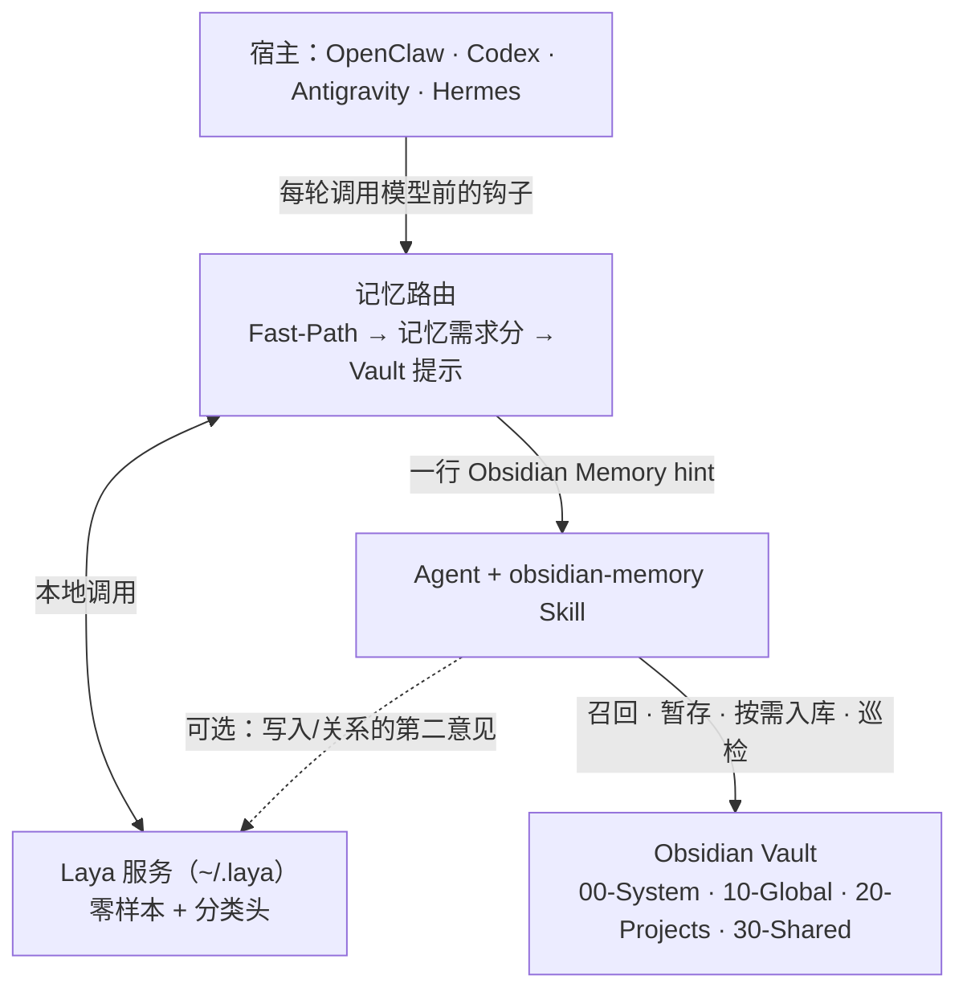

# 架构与名词

一句话：**Skill 是规则的主人，宿主接入层把它接进四个 Agent，记忆路由在每轮开头给一行建议，Laya 是路由用的本地模型，Vault 是存放记忆的 Markdown 文件。**



路由是可选的优化层：`mode: off` 或 Laya 不可用时，Skill 照常工作，只是每轮都按"可能需要记忆"处理。

## 名词表

| 名词 | 是什么 | 在哪 |
|---|---|---|
| 常驻规则 | 所有宿主都带的一句话："代码任务先用 obsidian-memory Skill，除非本轮提示说不需要" | 唯一来源 `lib/guidance.json` |
| 每轮提示（Obsidian Memory hint） | 路由在本轮开头加的一行 `[Obsidian Memory hint: …]`：*不需要记忆* / *先查记忆* / *用户要求保存*。只是建议 | `lib/prompt.js` |
| 召回（Recall） | Skill 里真正去搜 Vault 的步骤：只搜当前范围的 wiki / raw / checkpoints，必要时看 pending inbox | `SKILL.md` |
| 记忆需求分 | Laya 给出的 0–1 分，表示本轮是否需要长期记忆。服务接口仍叫 `/judge/recall` | `lib/laya-service/service.py` |
| 分类头（recall head） | 在 Laya 句向量上训练的逻辑回归，替代零样本打分 | `~/.laya/recall-head.json`，插件自带一份 |
| 暂存（Capture） | Skill 把值得长期保存的内容写成 `inbox/` 下的 `pending-ingest` 候选 | `SKILL.md` |
| 入库（Ingest） | 只在用户要求时，把候选冻结为 raw 并整理进 wiki | `SKILL.md` |

## 写入由谁决定

**只有 Skill 的规则能决定写入。** 其他来源都只是信号：

1. 用户明确要求（"记住……""写到 agent.md""记录一下这个坑"）→ Fast-Path 给出 *用户要求保存* 提示 → Skill 按暂存规则写 inbox 候选。
2. 没有明确要求时，Skill 自己判断：两条相关性测试都通过才可以自动暂存。
3. Laya 的 `capture` 判断（`obsidian-memory-laya-judge --capture`）只能在第 2 步已经成立时作为第二意见；它说"不"或出错就不写，它从不单独触发写入。
4. 模型按分类在每轮主动建议写入的旧机制已移除（真实提示上 40 次触发 0 次正确）；配置里的 `layaCapture` 保留为无效兼容项。

入库时 Laya 的 `relation` 判断同样只是建议，不能授权合并、替代或删除。

## 每轮路由

1. `fast-path.js`：含密钥 / 问候 → 跳过；明确要求保存 → *保存*；"还记得""去 obsidian 查""照老规矩" → *先查记忆*。
2. 记忆需求分（Laya，优先用分类头）。通用知识、写作、询问助手本身的问题不会因分数偏高而查记忆。
3. `vault-index.js`：与 Vault 笔记标题等词匹配；只在判断拿不准时升为 *先查记忆*，并阻止跳过。
4. `turn-context.js`：会话延续；把判断写入本机 `~/.laya/decisions.jsonl` 供标注。
5. 输出：≥ 0.50 *先查记忆*；< 0.35 *不需要记忆*；中间或 Laya 不可用 → 不加提示。模式 `off` / `auto`（出错放行）/ `strict`（出错拦截，仅 Codex、OpenClaw）。

## 各宿主读哪些文件

每个宿主只认自己的格式，所以清单和配置位置无法合并；内容由单一来源生成，由测试和 `laya doctor` 保证一致。

| 宿主 | 插件清单 | 每轮钩子 | 常驻规则注入 | Vault 路径配置 | 安装 / 更新 |
|---|---|---|---|---|---|
| OpenClaw | `openclaw.plugin.json` + `index.js` | `before_prompt_build` / `before_agent_run` | 每轮 `prependContext` | `openclaw.json` → `agentConfigs.<agent>.vaultPath` | `openclaw plugins install <tgz> --force` |
| Codex | `.codex-plugin/plugin.json` + `hooks/hooks.json` | `UserPromptSubmit` | `~/.codex/AGENTS.md` 受管区块 | 同一受管区块 | `codex plugin marketplace upgrade` + `codex plugin add` |
| Antigravity | `plugin.json` + `hooks.json` | `PreInvocation` | `~/.gemini/GEMINI.md` 受管区块 | 同一受管区块 | 放入发布包到 `~/.gemini/config/plugins/` |
| Hermes | `plugin.yaml` + `__init__.py`（安装时还校验 `plugin.json`） | `pre_llm_call` | 系统提示词区块 | `config.yaml` → `settings.vault_path` | `hermes plugins install annual30k/obsidian-memory-plugin --force` |

`OBSIDIAN_MEMORY_VAULT` 环境变量可以覆盖以上任意一处。`package.json` 给 npm / OpenClaw 用，`.agents/plugins/marketplace.json` 是 Codex 的 marketplace 条目。版本号用 `npm run version:set -- X.Y.Z` 一次改齐，`tests/manifests.test.mjs` 在不一致时失败。

## 工具

| 命令 | 用途 |
|---|---|
| `laya install` / `start` / `stop` / `status` | 管理本地 Laya 服务 |
| `laya label` | 标注积累的真实提示（y 先查记忆 / c 保存 / n 不需要 / x 单句判断不了）；`--review` 校对已有标注 |
| `laya train` | 用标注训练分类头并自动重启服务 |
| `laya doctor` | 只读体检：四个宿主的版本、安装方式、Vault 路径是否一致 |
| `laya eval` | 在标注集上评估（`--errors` 列出误判） |
| `laya tune` / `calibrate-vault` / `bench` | 高级：比较 Laya 提问、校准 Vault 匹配阈值、性能基准 |

日常只需要 `laya label` → `laya train`。

## 文件地图

```text
skills/obsidian-memory/      Skill：SKILL.md + references/（Vault 结构、初始化、模板、ID 与恢复、依赖）
lib/guidance.json            常驻规则（唯一来源）
lib/prompt.js                每轮提示文字
lib/config.js                配置解析（四个宿主共用）
lib/managed-block.js         AGENTS.md / GEMINI.md 受管区块
lib/memory-router/           路由：fast-path、router、vault-index、turn-context、client、cache、circuit-breaker、auto-restart、schemas、security、cli
lib/laya-service/            Laya 服务（service.py）与插件自带分类头
index.js / __init__.py       OpenClaw / Hermes 适配器
scripts/*-hook.mjs           Codex / Antigravity 钩子
scripts/setup-*.mjs          各宿主配置向导
scripts/laya-service.mjs     laya 命令入口
scripts/doctor.mjs           体检
scripts/set-version.mjs      同步版本号
```
