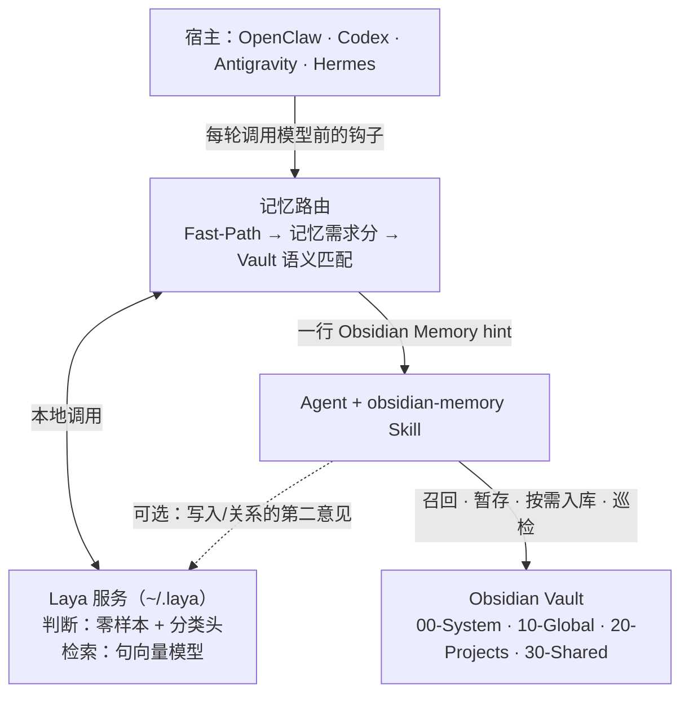
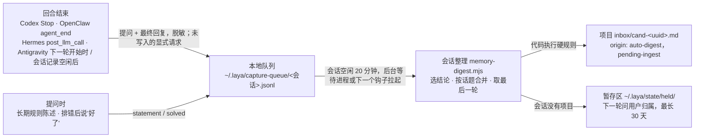

# 架构与名词

一句话：**Skill 是规则的主人，宿主接入层把它接进四个 Agent，记忆路由在每轮开头给一行建议，Laya 服务是路由用的本地模型（判断分 + Vault 检索），Vault 是存放记忆的 Markdown 文件。**



路由是可选的优化层：`mode: off` 或 Laya 不可用时，Skill 照常工作，只是每轮都按"可能需要记忆"处理。

- **`mode: off`** 等于没有路由：不调模型、不加每轮提示，也不写任何本机文件（没有会话状态、Vault 索引、判断日志、整理队列，不做会话整理，`~/.laya` 里什么都不新增）。只剩常驻规则和 Skill，由 agent 自己判断；你说"记住"时 agent 照样按 Skill 写 Obsidian inbox，只是没有回合结束的兜底检查。
- **Laya 没装或没启动**（默认 `auto`）：不依赖模型的部分照常运行，包括 Vault 词重叠提示、会话延续、判断日志、整理队列和按结论词筛选的会话整理，这些文件都在 `~/.laya`。

## 名词表

| 名词 | 是什么 | 在哪 |
|---|---|---|
| 常驻规则 | 所有宿主都带的一句话："代码任务先用 obsidian-memory Skill，除非本轮提示说不需要" | 唯一来源 `lib/guidance.json` |
| 每轮提示（Obsidian Memory hint） | 路由在本轮开头加的一行 `[Obsidian Memory hint: …]`：*不需要记忆* / *先查记忆* / *用户要求保存*。只是建议 | `lib/prompt.js` |
| 召回（Recall） | Skill 里真正去搜 Vault 的步骤：只搜当前范围的 wiki / raw / checkpoints，必要时看 pending inbox | `SKILL.md` |
| 记忆需求分 | Laya 给出的 0–1 分，表示本轮是否需要长期记忆。服务接口仍叫 `/judge/recall` | `lib/laya-service/service.py` |
| 分类头（recall head） | 在 Laya 句向量上训练的逻辑回归，替代零样本打分 | `~/.laya/recall-head.json`，插件自带一份 |
| 持久性判断头（durable head） | 在 Laya 句向量上训练的逻辑回归，判断用户这句话是不是以后也要遵守的规则/偏好/决定；用 `laya label` 的 `d` 标注积累数据，`laya train --target durable` 训练 | `~/.laya/durable-head.json`，插件自带一份 |
| 检索器（retriever） | Laya 服务里另一个小模型（默认 `intfloat/multilingual-e5-small`，纯 MLX 实现）：把本轮提示和 Vault 笔记都变成向量，回答"Vault 里有没有一篇笔记明显对应这句话" | `lib/laya-service/bert_embed.py`，笔记向量缓存在 `~/.laya/cache/vault-embeddings.json` |
| 突出度（prominence） | 最相关笔记的相似度减去所有候选笔记相似度的中位数。绝对相似度分不开（同一项目的笔记和任务本来就都相似），突出度问的是"有没有一篇特别对得上" | `lib/memory-router/vault-index.js` |
| 暂存（Capture） | Skill 把值得长期保存的内容写成 `inbox/` 下的 `pending-ingest` 候选 | `SKILL.md` |
| 入库（Ingest） | 只在用户要求时，把候选冻结为 raw 并整理进 wiki | `SKILL.md` |

## 写入由谁决定

**回合内只有 Skill 的规则能决定写入；回合外的自动暂存由会话整理（digest）按同一套硬规则在代码里执行。** 分两条路：

**一、显式要求：回合内，同步。** 用户说"记住……""写到 agent.md""记录一下这个坑" → Fast-Path 给出 *用户要求保存* 提示 → agent 按 Skill 在本轮结束前写 inbox 候选。这是唯一在回合内兜底的信号：路由在提问时记下目标 inbox 里最新候选的修改时间，回合结束时（OpenClaw `before_agent_finalize`、Codex `Stop`）若没有比它更新、且不是整理自动写的候选（新建或原地更新都算），就要求模型再跑一轮补上，每次请求最多一次；只比较文件时间和文件时间，不依赖系统时钟；解析不到项目时检测覆盖所有项目的 inbox，指令里不指定 Global。**回合结束时仍未写入**（agent 没照做、宿主忽略了补跑、或宿主根本没有回合结束控制）的请求会以 `explicit` 记录进入整理队列，由整理把用户原话写成候选（`auto_kind: explicit-request`），所以"记住"不会悄悄丢失；已交给整理的请求不再在下一轮提醒，避免写两份。

**二、自动暂存：回合外，异步（`autoCapture: "digest"`，默认）。**



1. **入队**（`capture-queue.js`）：钩子只把本回合的提问和最终回复（≥ 200 字）追加到该会话的私有队列文件，写入前脱敏，不调用任何模型，毫秒级。只收真实用户回合：OpenClaw 的 cron / heartbeat / 系统回合和模型调用失败的回合不入队，最后一条回复为空或报错时不往历史里回找；同一问答重复上报只记一次。队列按会话分文件：钩子追加到 `<会话>.jsonl`，整理开始前先把它原子改名为 `<会话>.<时间>-<pid>.claimed.jsonl` 再读，所以整理期间结束的回合会进新文件，不会随已领取的部分一起被删。Antigravity 没有回合结束钩子：上一轮在下一轮开始时入队，会话的**最后一轮**由钩子登记会话记录（`state/open-transcripts/`），等会话记录空闲 20 分钟后由整理补记。提问时的长期规则陈述（Laya 持久性判断头 ≥ 0.5，与召回提示互不排斥；或"以后……都……""统一用……""我对……过敏"这类确定性说法）、排错后用户说"好了/可以了"的确认也进队列，不再当场提示模型。显式"记住"的回合如果 agent 已经写了候选，标记 `staged`，整理时不再写第二份。
2. **整理**（`digest.js`、`scripts/memory-digest.mjs`）：某个会话 20 分钟没有新内容后开始整理。有队列但都还在进行中时，钩子会拉起一个后台等待进程（`--wait`，全机最多一个），它睡到会话空闲再整理，队列清空或 24 小时后退出，所以用户不再聊天也会整理；已经空闲的队列由下一个钩子直接拉起（同一时间只跑一个，两次之间至少隔 5 分钟）。也可以手动 `laya digest --now`。整理前先唤醒本地模型（后台最多等 45 秒，用户的回合从不等），这样结论词不够的回复也能拿到 Laya 分。整理时：
   - **选结论**：最终回复有 ≥ 2 个结论词且其中至少一个是强结论词（根因 / 原因是 / 修法 / 已修复 / 决定 / 约定 / 规则……），或 Laya capture 分 ≥ 0.5，或之后被用户确认"好了"的回合；通用知识问答（"X 和 Y 的区别"）不算，除非用户确认了修复。
   - **按话题合并，只取最后一轮**：9 月的真实数据里，触发集中在同一个问题的连续排查中（有触发的会话平均 5.5 次，89% 的触发落在触发 ≥ 3 次的会话里），而 36 个多次触发的会话里有 12 个后来改口。所以同一话题只保留最后一轮结论；有检索器时按回复的语义相似度分话题（余弦 ≥ 0.91：在手写的结论对上，同一问题改口后的结论为 0.907～0.937，同项目不同问题为 0.85～0.911；尚未用真实数据校准），没有时整个会话算一个话题。每个会话最多 2 个话题、2 条用户陈述（分数高的优先）。
   - **硬规则在代码里执行**：Vault 已初始化（有 `AGENTS.md` 和 `00-System/`）；项目已绑定且 inbox 存在（不创建项目结构，不猜范围，项目内容永远不进 Global）。范围按类别定：会话结论只进所属项目；用户陈述和显式请求里，带"全局/跨项目/global"整词、或说的是用户本人（"我对……过敏""回复我用中文"）的进 `10-Global/inbox/`（`globalThis` 之类不算），其余进所属项目。**解析不到项目时不猜**：按 Skill "If only one scope is unresolved, hold that part"，这些发现放进 Vault 之外的暂存区 `~/.laya/state/held/`，下一轮提示让 agent 问用户归到哪个项目、Global 还是丢弃，并用 `laya digest --held / --file <id> --project <id>|--global / --discard <id>` 执行（写入仍走整理的全部硬规则），30 天未处理自动过期；Vault 或项目的 `AGENTS.md` / `rules.md` 里有 `no-auto-capture`（或"禁止自动记录""只召回"等）就不写；含凭据的回合整条不写，写文件前再对成稿扫一遍凭据；优先用 Vault 自己的 `00-System/templates/inbox-memory-candidate.md`（`{{title}}` 和 `<…>` 两种占位写法都支持）；`cand-<uuid>` 文件名、`wx` 独占创建、路径不出 Vault；同一会话同一结论不写第二次；同样文字（忽略空白）的结论在该 inbox 已有候选（`source_hash`）就不写；与已有 auto-digest 候选余弦 ≥ 0.95 视为重复。标题取自提问，提问是"继续""好的"这类时取结论第一行。
   - **候选内容是原话证据**：提问原文 + 最后一轮结论原文（引用），标 `origin: auto-digest`、来源宿主和会话，附检索器找到的相关笔记。归纳提炼留到用户发起 ingest 时做。
   - 处理完只删除本次领取的部分，结果记在 `~/.laya/digest-log.jsonl`（含 Vault 路径，出错的也记）。Vault 暂时读不到（此时也解析不出项目，不会误放进暂存区）或整理出错时保留已领取的部分，下次和新回合一起再试；超过 7 天的也先整理，整理不了才删除并记日志。
   - **让用户知道**：下一轮提示里告诉 agent 整理暂存了几条候选（每批只说一次），由它在回复末尾用一句话告诉用户；`npm run doctor` 显示队列积压、上次整理时间、7 天内写入数和暂存区条数，并报出卡住或写满 2 MB 的队列、暂存待定的发现、索引超上限被裁掉的笔记和没注册 / 没批准的 Codex 钩子。`laya digest --stats` 统计候选最终的去向（待审 / 已 ingest / 被删），即保留率，用来校准门槛。
3. **其他模式**：`revise`（回合结束时让模型当场再跑一轮暂存，实测每次写入约 66 秒、平均每回合多 15～20 秒）、`remind`（下一轮提醒）、`off`（关闭自动暂存；显式要求照常）。`proactiveCapture: false` 关闭全部主动信号。

**对比回合内补跑**（`revise`）：digest 不让用户等（钩子毫秒级，补跑实测 4～66 秒），不额外调用大模型，硬规则由代码执行而不是靠模型读完 Skill，同一问题不重复记，也不会记下中途被推翻的结论；覆盖四个宿主（Antigravity 通过会话记录在下一轮开始时补记上一轮，最后一轮在会话空闲后由整理从会话记录补记）。代价是候选只是原话证据、要到会话结束后才出现。

Laya 的 `capture` 判断（`obsidian-memory-laya-judge --capture`）在回合内只能作为已通过测试的候选的第二意见；在 digest 里它只用来补救结论词不够的回复。按分类在每轮主动建议写入的旧机制已移除（真实提示上 40 次触发 0 次正确）；配置里的 `layaCapture` 保留为无效兼容项。

入库时 Laya 的 `relation` 判断同样只是建议，不能授权合并、替代或删除。

## 每轮路由

"要不要查记忆"和"查哪一篇"是两个问题。只看单句文本的模型答不了前者（真实流量里需要记忆的提问几乎都靠显式规则就能抓到，剩下的取决于 Vault 里有什么）；检索能答后者。所以路由把两者合起来：

1. `fast-path.js`：含密钥 / 问候 → 跳过；明确要求保存 → *保存*；"还记得""去 obsidian 查""照老规矩" → *先查记忆*。
2. 记忆需求分（Laya，优先用分类头），同一次调用顺带返回本轮提示的向量。通用知识、写作、询问助手本身的问题不会因分数偏高而查记忆。
3. `vault-index.js`：用检索器给 Vault 的 wiki / inbox 笔记建向量缓存（每轮最多补 32 篇，改过的笔记自动重算），算本轮提示的突出度：
   - **强**（默认 ≥ 0.048）：改为 *先查记忆*，即使分数说不需要；提示里列出最相关的 1–3 篇笔记路径。
   - **弱**（≥ 0.038）：本轮不跳过，附上笔记。
   - 检索器不可用（PyTorch 后端、旧服务、`vaultSemantic: false`）时退回词重叠匹配，只补拿不准的轮次。
4. `turn-context.js`：会话延续；把判断写入本机 `~/.laya/decisions.jsonl` 供标注。
5. 输出：分数 ≥ 0.50 或强匹配 → *先查记忆*；分数 < 0.35 且无匹配 → *不需要记忆*；其余或 Laya 不可用 → 不加提示。模式 `off` / `auto`（出错放行）/ `strict`（出错拦截，仅 Codex、OpenClaw）。

在作者的 Vault 上（501 条真实无关提示 + 66 条针对 Vault 内容的提问）测得：只用分类头时误跳过 5%、召回 86%；加上检索突出度后误跳过 0%、召回 98%，无关提示仍有 83% 被跳过。Laya 自己的句向量做检索接近随机（AUC 0.39～0.57），所以检索器是单独的模型。

## 本机文件

插件在本机只用一个文件夹 `~/.laya`（和 Laya 服务共用；`LAYA_HOME` 可以改它的上级目录，与 `laya` 命令一致）。路径统一由 `lib/memory-router/paths.js` 给出。

| 位置 | 内容 | 能不能删 |
|---|---|---|
| `service.json` `service.sock` `daemon.pid` `venv/` | Laya 服务 | 用 `laya stop` / `laya uninstall` |
| `recall-head.json` `durable-head.json` | 用你的标注训练的判断头 | 删了回到插件自带的 |
| `labels*.jsonl` `testsets/` | 标注 | 你的数据 |
| `decisions.jsonl` | 每轮判断日志（供 `laya label`） | 可以 |
| `digest-log.jsonl` | 会话整理写了什么、跳过了什么 | 可以 |
| `capture-queue/` | 等待整理的回合（`<会话>.jsonl` 正在追加，`*.claimed.jsonl` 已被整理领取；整理后自动删除，超过 7 天且整理不了才删除） | 删了这些回合就不整理了 |
| `state/` | 会话状态、服务健康缓存、整理记录与锁、Antigravity 回合记录与会话记录登记、暂存区 `held/`、补算向量的暂停记录 | 可以，会重建（`held/` 里是等你决定的发现，删了就丢了） |
| `cache/` | Vault 索引和笔记向量 | 可以，会重建 |

旧版本放在 `~/.cache/obsidian-memory-plugin`（Windows 为 `%LOCALAPPDATA%\obsidian-memory-plugin`）的文件会在第一次运行时自动搬进来，旧文件夹清空后删除。

## 各宿主读哪些文件

每个宿主只认自己的格式，所以清单和配置位置无法合并；内容由单一来源生成，由测试和 `laya doctor` 保证一致。

| 宿主 | 插件清单 | 每轮钩子 | 常驻规则注入 | Vault 路径配置 | 安装 / 更新 |
|---|---|---|---|---|---|
| OpenClaw | `openclaw.plugin.json` + `index.js` | `before_prompt_build` / `before_agent_run`，回合结束 `before_agent_finalize` | 每轮 `prependContext` | `openclaw.json` → `agentConfigs.<agent>.vaultPath` | `openclaw plugins install <tgz> --force` |
| Codex | `.codex-plugin/plugin.json` + `hooks/hooks.json`（插件页 Hooks 一栏 Trust all 批准一次；根 `plugin.json` 不得声明 Agent Plugins `$schema`，否则 Codex 忽略钩子） | `UserPromptSubmit`，回合结束 `Stop` | `~/.codex/AGENTS.md` 受管区块 | 同一受管区块 | `codex plugin marketplace upgrade` + `codex plugin add` |
| Antigravity | `plugin.json` + `hooks.json` | `PreInvocation` | `~/.gemini/GEMINI.md` 受管区块 | 同一受管区块 | 放入发布包到 `~/.gemini/config/plugins/` |
| Hermes | `plugin.yaml` + `__init__.py` | `pre_llm_call` | 系统提示词区块 | `config.yaml` → `settings.vault_path` | `git clone` 到 `~/.hermes/plugins/obsidian-memory-plugin` + `hermes plugins enable`；更新用 `git pull`（`hermes plugins install` 会按 Agent Plugins 校验根 `plugin.json`，不支持） |

`OBSIDIAN_MEMORY_VAULT` 环境变量可以覆盖以上任意一处。`package.json` 给 npm / OpenClaw 用，`.agents/plugins/marketplace.json` 是 Codex 的 marketplace 条目。版本号用 `npm run version:set -- X.Y.Z` 一次改齐，`tests/manifests.test.mjs` 在不一致时失败。

## 工具

| 命令 | 用途 |
|---|---|
| `laya install` / `start` / `stop` / `status` | 管理本地 Laya 服务（`status` 显示分类头和检索器；`start --embed-model off` 关闭检索器） |
| `laya digest` | 立即整理已结束的会话，把结论暂存进 inbox（`--now` 包括未空闲的会话，`--dry-run` 只报告） |
| `laya label` | 标注积累的真实提示（y 先查记忆 / c 保存 / d 陈述长期规则 / n 不需要 / x 单句判断不了）；`--review` 校对已有标注 |
| `laya train` | 用标注训练分类头并自动重启服务；`--target durable` 训练持久性判断头 |
| `laya doctor` | 只读体检：四个宿主的版本、安装方式、Vault 路径是否一致 |
| `laya eval` | 在标注集上评估（`--errors` 列出误判） |
| `laya tune` / `calibrate-vault` / `bench` | 高级：比较 Laya 提问、校准 Vault 匹配阈值、性能基准 |

日常只需要 `laya label` → `laya train`。

## 文件地图

```text
skills/obsidian-memory/      Skill：SKILL.md + references/（Vault 结构、初始化、模板、ID 与恢复、依赖）
lib/guidance.json            常驻规则（唯一来源）
lib/prompt.js                每轮提示文字
lib/config.js                配置解析（四个宿主共用）
lib/managed-block.js         AGENTS.md / GEMINI.md 受管区块
lib/memory-router/           路由：fast-path、router、vault-index、turn-context、capture-queue、digest、paths（本机文件位置）、client、cache、circuit-breaker、auto-restart、schemas、security、cli
lib/laya-service/            Laya 服务（service.py）、检索器编码器（bert_embed.py）与插件自带分类头
index.js / __init__.py       OpenClaw / Hermes 适配器
scripts/*-hook.mjs           Codex（提问、Stop）/ Antigravity 钩子
scripts/memory-digest.mjs    会话整理（后台自动运行，或 laya digest）
scripts/setup-*.mjs          各宿主配置向导
scripts/laya-service.mjs     laya 命令入口
scripts/doctor.mjs           体检
scripts/set-version.mjs      同步版本号
```
